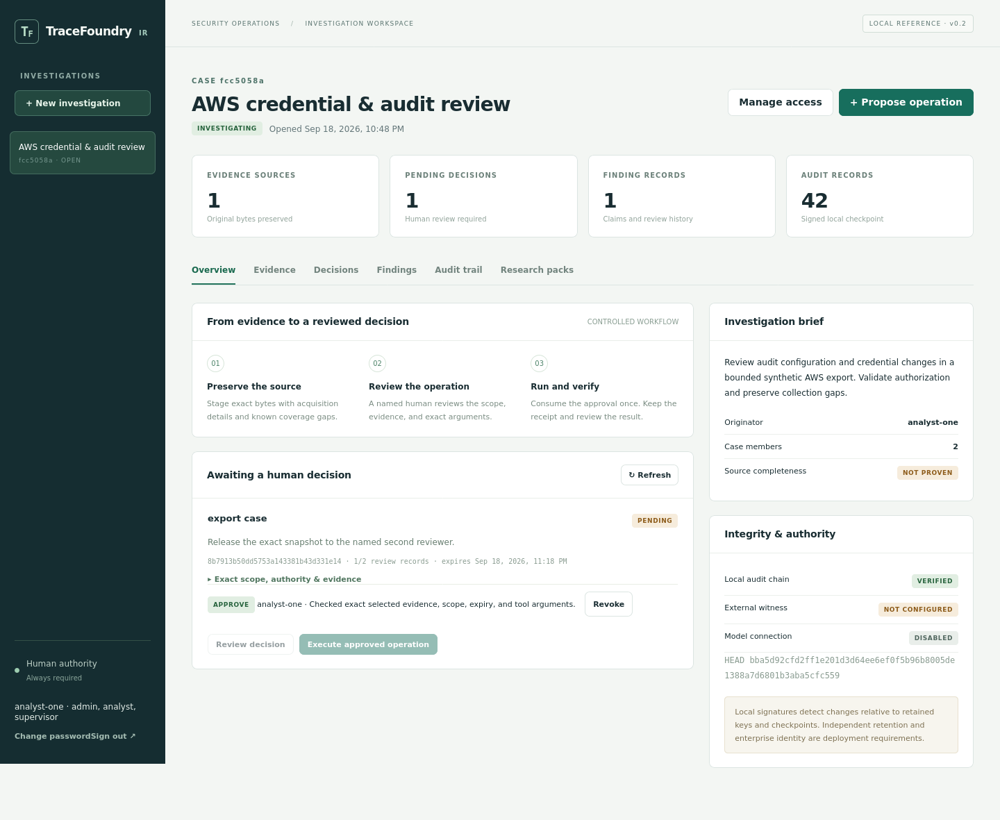

# TraceFoundry IR

**Human-authorized incident investigations with accountable evidence.**

TraceFoundry IR is a working local application for preserving log exports, proposing bounded analysis, recording signed human reviews, and reconstructing what happened. It adapts the research-to-tool idea in [Paper2Agent](https://arxiv.org/abs/2509.06917v2) to incident response. Research methods become validated, declarative investigation packs; imported papers and evidence never become executable authority.



## What runs today

- Browser console with named accounts, case access, evidence staging, decisions, findings, research packs, and audit inspection.
- JSON/JSONL import for AWS CloudTrail, Microsoft 365 audit exports, OCSF-shaped events, and a documented generic format. These are bounded import adapters, not complete vendor collectors or an OCSF compliance claim.
- Exact-scope timeline queries, rule-based candidate findings, reviewed finding acceptance, coverage gaps, and supervisor-authorized closure.
- Optional model assessment through an operator-configured HTTPS chat-completions-compatible endpoint. Nothing is sent to a model by default. Model output cannot approve or execute an operation.
- Optional model drafting of declarative investigation packs from supplied research text, followed by validation and a separate two-person release decision.
- P-256 signed approval attestations, current-role and case-membership checks, expiry, revocation, and single-use execution intents.
- Two distinct eligible accounts for exports, external model disclosure, and research-pack release.
- AES-GCM encrypted raw artifacts; SHA-256 acquisition hashes; resolvable record citations; RFC 8785 canonical decision and audit hashes.
- Append-only audit tables, signed local checkpoints, checkpoint history, and an offline export verifier requiring independently obtained public keys and a checkpoint pin.

**Version 0.1 is a local reference implementation.** Its services share one process and host. Enterprise SSO/MFA, managed signing keys, independently operated witnesses, WORM retention, native cloud collectors, production containment, multi-host workers, and independent security certification are not implemented. See [implementation status](docs/IMPLEMENTATION_STATUS.md) for the boundary between the original design and this release.

## Run locally

Requires Python 3.11 or newer. Python 3.12 is the primary tested runtime. On Windows, use PowerShell:

```powershell
git clone https://github.com/Scoston/tracefoundry-ir.git
cd tracefoundry-ir
py -3.12 -m venv .venv
.\.venv\Scripts\python.exe -m pip install --require-hashes -r requirements.lock
.\.venv\Scripts\python.exe -m pip install --no-deps .
.\.venv\Scripts\tracefoundry.exe init --username stephen
.\.venv\Scripts\tracefoundry.exe user-add --username reviewer --roles supervisor
.\.venv\Scripts\tracefoundry.exe serve
```

On Linux or macOS:

```bash
git clone https://github.com/Scoston/tracefoundry-ir.git
cd tracefoundry-ir
python3 -m venv .venv
.venv/bin/python -m pip install --require-hashes -r requirements.lock
.venv/bin/python -m pip install --no-deps .
.venv/bin/tracefoundry init --username stephen
.venv/bin/tracefoundry user-add --username reviewer --roles supervisor
.venv/bin/tracefoundry serve
```

Open **http://127.0.0.1:8000**. Initialization prompts for a password of at least 14 characters; no default accounts, passwords, approvals, or production credentials are shipped. The initial account has administrator, analyst, and supervisor roles. A second named human is still required for two-person operations. Assign each real person one account.

## First investigation

1. Create a case and add the second reviewer through **Manage access**.
2. Open **Evidence → Stage evidence**, choose `examples/cloudtrail-synthetic.json`, and describe its synthetic coverage.
3. Choose **Propose import**, select CloudTrail, and record the purpose.
4. In **Decisions**, inspect the exact body and digest, select **Review decision**, enter a rationale, and re-enter your password.
5. Select **Execute approved operation**. The import receipt records its scope and any parsing gaps.
6. Propose a `timeline` or `suggest_findings` operation. Each new operation needs another review. Findings remain candidates until a separate `accept_finding` decision is approved and executed.
7. For an export, select exact artifacts and a named recipient. Two eligible accounts must review it, including a supervisor. The recipient can retrieve the resulting export while the grant remains valid.

Read the [analyst guide](docs/ANALYST_GUIDE.md), [administration guide](docs/ADMINISTRATION.md), and [API guide](docs/API.md). [Research pack authoring](docs/RESEARCH_PACKS.md) explains source attribution, test vectors, release, and reuse.

## Repository map

| Path | Purpose |
| --- | --- |
| `src/tracefoundry_ir/` | API, approval gateway, storage, crypto, importers, model boundary, verifier, CLI |
| `src/tracefoundry_ir/static/` | Browser application; no CDN or build tool required |
| `tests/` | Functional, security, failure, integrity, and parser tests |
| `examples/` | Fictional log exports for repeatable evaluation |
| `packs/` | Declarative research pack with positive and negative tests |
| `docs/design/` | Original 22-page Word design, Markdown source, schemas, diagrams, contracts, and design checks |
| `docs/` | Current implementation, security, operating, API, and validation documentation |
| `scripts/` | Browser acceptance and source package validation helpers |
| `.github/workflows/` | Pinned CI actions, test matrix, dependency audit, browser check, wheel build |

## Verify the code

```bash
python -m pip install --require-hashes -r requirements-dev.lock
python -m pip install --no-deps -e .
ruff check src tests scripts
ruff format --check src tests scripts
pytest --cov=tracefoundry_ir --cov-report=term-missing
python docs/design/verification/validate_design.py
python -m pip_audit -r requirements.lock
python -m build
```

The original design's 40 acceptance scenarios remain preserved as requirements. The executable tests and their measured results are separately reported in [validation](docs/VALIDATION.md); this repository does not equate design checks with production control validation.

The recorded local run passed **84 tests**, the full Firefox analyst workflow, the pinned runtime dependency audit (27 dependencies, no reported vulnerabilities), and the wheel/source build. See the [measured results](docs/validation/results.json) for source hashes, coverage, conditions, and limits.

## Evidence and trust limits

A local hash proves a byte comparison, not source truth or completeness. Human acceptance does not turn a hypothesis into an observation. Local signatures depend on custody of the signing keys; a host administrator with all keys and state can rewrite history. Keep trusted public keys and checkpoint pins outside the application's administration. The application has no independent witness or retention-enforcement service.

Case members can retrieve authorized raw evidence. The two-person export workflow governs formal case bundles; it is not a data-loss-prevention boundary against someone already permitted to read the data. Source bytes and model exchanges are encrypted in the local vault, while case metadata, normalized rows, decision arguments, findings, and audit metadata require protected disks and backups.

No live vendor account, enterprise identity provider, or paid model was used for the included tests. No production response actions are available in this release.
