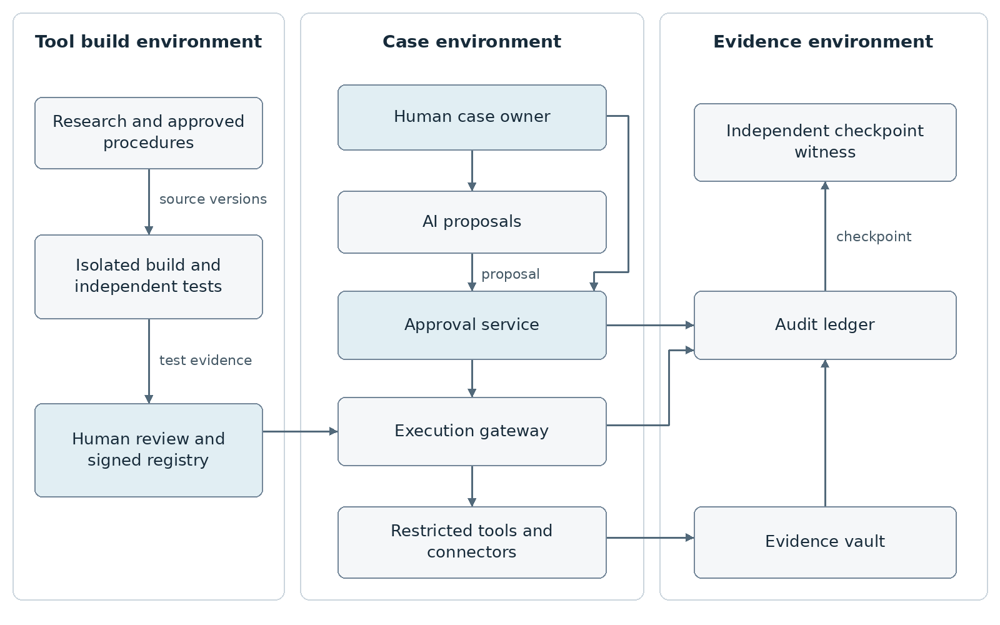
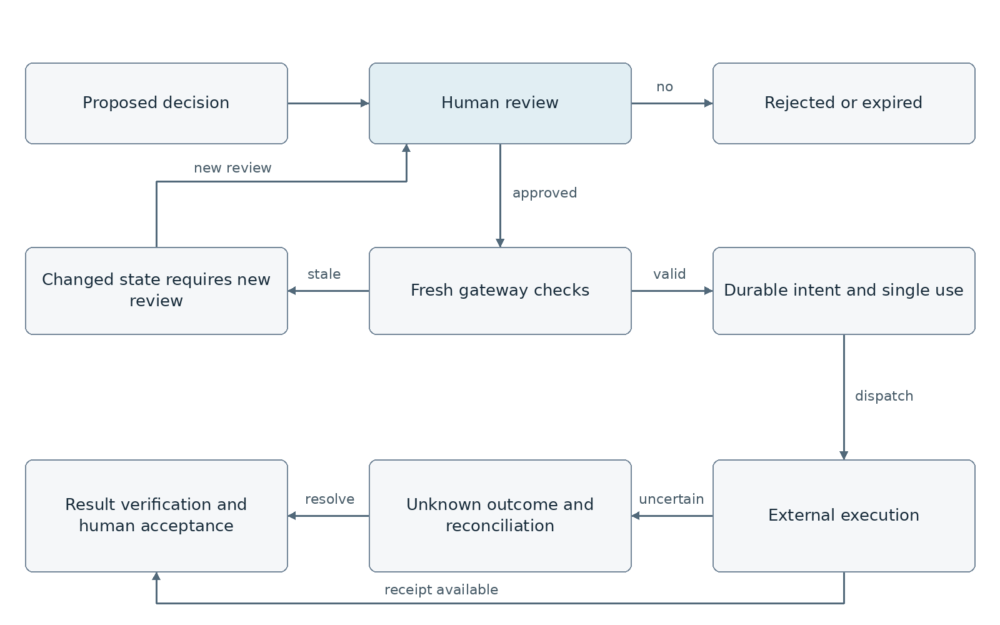

# TraceFoundry IR Cybersecurity Tool Design

Version 0.1 | 18 September 2026 | Prepared for Stephen Coston

## Purpose and recommendation

Build TraceFoundry IR as a controlled system that converts cybersecurity research, approved incident response procedures, and reference code into reusable investigation tools. Analysts would use those tools through a case workspace, with a human approving every operational decision and an evidence record connecting the decision to its sources, execution, and outcome.

The design adapts Paper2Agent's method of extracting, testing, and packaging tools. It adds a separate approval service, a restricted execution gateway, an evidence vault, and an independently verifiable audit ledger. Tool development and live incident execution operate in separate environments. [S1]

**The operating rule:** AI may propose a question, finding, or action. A named, authenticated human must approve it before it changes the investigation, exercises a tool, adopts a conclusion, changes a system, releases evidence, or closes a case. Lack of an approver means the workflow waits or escalates; it never becomes approval.

## Intended users and initial scope

Tier 1 analysts receive guided evidence collection and clear escalation prompts. Tier 2 analysts and incident responders review correlations and proposed findings. Supervisors control investigative scope and closure. Incident commanders and system owners authorize containment and restoration. Evidence custodians manage preservation and release.

Start with two investigation packs: suspected Microsoft 365 or Copilot agent abuse, and suspected AWS credential misuse. Initially operate on imported evidence and approved read operations. Add production response adapters only after the approval, integrity, and failure recovery controls pass testing.

## Required outcomes

- Every accepted finding resolves to preserved evidence and a human decision record.
- Every tool invocation has an approved, immutable action description and an execution receipt, or an explicit unresolved outcome.
- Every artifact records its source, collector, transformations, access history, and retention policy.
- Every change to tools, prompts, policy, permissions, or case scope creates a new version and a fresh approval requirement.
- Every missing log source, unavailable field, partial export, and failed collection remains visible in the case and final report.

This is a technical design and implementation contract. The schemas and examples specify intended behavior; they do not constitute a deployed product or a verified security boundary.

<!-- page -->

## What the paper establishes

The attached paper is **Paper2Agent Reimagining Research Papers As Interactive and Reliable AI Agents**, arXiv 2509.06917v2, dated 16 October 2025. Its extended methods describe an orchestrator and specialists for environment preparation, tutorial discovery, tool extraction, and iterative verification. The output exposes executable tools, supporting resources, and workflow prompts through MCP. [S1, pp 4-5 and 18-19]

The preprint reports 22 AlphaGenome tools generated in about three hours, and correct results on 15 tutorial queries and 15 novel queries. It also demonstrates TISSUE and Scanpy workflows. These are specific scientific evaluations. They do not establish accuracy on security incidents, resistance to hostile evidence, or safe authorization of production changes. Figure 5 explicitly presents human involvement as optional. [S1, pp 5-14]

A Nature version was published on 16 September 2026. It expands the evaluation: 74 of 100 computational biology papers were successfully converted, with 593 of 599 proposed tools passing automated validation. It reports 91.2 ± 1.6% accuracy on 300 tutorial-derived questions. Those broader results support feasibility while also showing that conversion and execution are imperfect. The uploaded preprint and this later publication must be distinguished when citing results. [S2]

## How the approach transfers to incident response

| Paper2Agent element | TraceFoundry IR adaptation |
| --- | --- |
| Paper and associated repository | Research, approved SOP, reference code, vendor documentation, and local applicability rules |
| Environment preparation | Isolated build environment, dependency lock, software inventory, restricted egress, and build provenance |
| Tutorial extraction | Small investigation operations with typed inputs, source references, explicit limits, and expected artifacts |
| Iterative testing | Human-authored reference cases, independent expected results, adversarial evidence, and authorization tests |
| MCP tools resources and prompts | Signed investigation pack, evidence references, and a versioned workflow with mandatory decision gates |
| Agent collaboration | Recorded delegation with bounded authority, separate identities, and human approval at each decision |

The reusable unit should be an investigation capability, such as reconstructing an identity session from preserved logs. A complete paper is not always the right operational boundary. A paper without executable code can become a reference resource; it must not be represented as a validated executable method.

<!-- page -->

## System architecture

The **build environment** has public research inputs and synthetic or authorized test data. It cannot access production secrets. Its output becomes usable only after independent technical review and signed release.

The **case environment** contains the analyst workspace, a proposal-only AI planner, an approval service, and an execution gateway. The planner cannot obtain production credentials, approve its own work, write accepted findings, or update the installed tool registry.

The **evidence environment** preserves raw artifacts, restricted model transaction records, the audit ledger, and verification checkpoints. A different administrative role controls retention and checkpoint witnessing. The search index and case database are rebuildable views; they are not the authoritative evidence store.

All connectors, including notebooks and SOAR integrations, must call the same execution gateway. A privileged MCP server or notebook kernel reachable outside that gateway would invalidate the intended approval boundary.

<!-- page -->

## Turning source material into an approved investigation pack

**1 Select and register sources.** A human chooses the method and intended use. Preserve document bytes and SHA-256, publication version, repository URL and commit, relevant sections, retrieval time, license information, owner, and known limitations. Distinguish statements in a source from conclusions drawn by the tool builder. The maintained Paper2Agent repository is useful implementation context, but its current contents must not be treated as the exact preprint implementation. [S3]

**2 Review applicability.** An incident response engineer specifies supported log schemas, required fields, assumptions, expected errors, and operational effects. A method tested on one vendor's logs remains restricted until adapters for other sources are independently verified. Contradictory papers or outdated guidance are presented for review rather than silently reconciled.

**3 Build in isolation.** Generate candidate wrappers in an ephemeral container or stronger sandbox appropriate to the code. Use read-only source mounts, no production credentials, limited CPU and memory, and allowlisted dependency mirrors. Disable package lifecycle scripts unless separately reviewed. Capture source commits, lockfiles, image digests, build steps, and dependency inventories. SLSA provenance provides a useful model for linking builds to their inputs. [S18]

**4 Specify tools and workflow.** Each tool declares its input and output schema, evidence dependencies, exact privileges, network destinations, resource limits, side effects, failure modes, and source references. Separate an analysis tool from a response tool even when both use the same vendor API. Generated prompts cannot grant authority.

**5 Test against independent expectations.** Run preserved reference fixtures and analyst-authored expected results. Include missing fields, duplicates, hostile text, time skew, schema drift, and partial results. Generated tests can help, but the same model writing a wrapper and its expected answer is insufficient evidence of correctness. Failed capabilities remain unavailable.

**6 Review and release.** A technical reviewer approves method fidelity and permissions. A separate release approver approves promotion. Sign the pack manifest and image digest. The registry records owners, validity dates, supported environments, test reports, and revocation status. Runtime access is restricted to an explicitly approved pack version.

**7 Maintain and revoke.** A changed dependency, source method, tool schema, prompt, model configuration, or permission set triggers impact review and revalidation. A revoked pack cannot start new work. Cases retain the old pack and evidence references so previous work can still be examined safely offline.

<!-- page -->

## Human approval for every decision

An operational decision includes selecting a data source or tool, setting a query window, choosing a branch, changing scope, accepting or rejecting a finding, classifying severity, selecting containment, restoring a service, releasing evidence, and closing a case. AI outputs remain **proposed** until reviewed. Even an accepted hypothesis remains a hypothesis when its evidence is incomplete.

| Decision | Minimum human authority | Additional condition |
| --- | --- | --- |
| Open case and set scope | Assigned analyst with case permission | Tenant, assets, purpose, and evidence access explicitly recorded |
| Select collection or analysis | Authorized analyst | Exact tool, inputs, target, query, and cost ceiling reviewed |
| Expand scope or cross a data boundary | Supervisor or delegated case lead | Data owner approval where required by case policy |
| Accept findings or severity | Qualified case analyst | Evidence links, contradictions, and gaps reviewed |
| Change a production resource | Incident commander or delegated responder | Second distinct approver; service owner for critical assets |
| Restore or roll back a resource | Authorized response lead and second approver | Fresh preconditions and impact review |
| Release evidence outside the case | Evidence custodian and designated release authority | Recipient, artifact versions, purpose, and redactions approved |
| Close case | Supervisor | Accepted findings, unresolved gaps, recovery status, and preservation verified |
| Release tools or change approval policy | Technical reviewer and independent release approver | No self-promotion or change from the case agent |

## What can run after approval

Mechanical work such as hashing bytes, enforcing access policy, validating a schema, formatting a report draft, or processing an explicitly approved input set can execute under the recorded human instruction. It may not choose another source, widen a query, substitute a tool, or continue down a newly selected branch.

The default interface presents one decision at a time. A person may approve several fully enumerated actions only by reviewing and selecting each item; each receives its own decision and approval record. There is no blanket approval of unspecified future agent activity.

Preconfigured denials and pauses enforce the human-approved policy automatically. They cannot authorize work. Emergency operation requires a named human approval before action, with the same durable record. If the service is unavailable, an established human-led incident process remains necessary; the product must not fabricate an approval after the event.

<!-- page -->

## Approval lifecycle and enforcement

An immutable decision envelope binds the case and tenant, proposal version, tool and image digest, exact parameters, resolved target identifiers, evidence versions and hashes, policy version, required roles, preconditions, expiration, resource limits, and proposed verification or rollback steps. Approval signs the digest of that envelope, not a summary or chat message.

The approval service derives the approver's identity and current role from authenticated sessions. Step-up authentication is required for response and evidence release. It records the human's choice, rationale, review time, authentication assurance, and the exact review view presented. The service signs an attestation; that signature authenticates the service record, not proof that the human understood the decision.

Immediately before execution, the gateway verifies role eligibility, required distinct approvers, signature trust, digest equality, expiration, revocation, current policy, target state, evidence freshness, and remaining budget. Any change returns the action to review. A resumed workflow is not itself an authorization: LangGraph supports durable interrupts, but authorization must remain outside the model and graph state. [S12]

Approval use is consumed atomically with a durable execution intent and a monotonically increasing fencing token. Concurrency cannot start the same authorized action twice. A suggested default approval lifetime is ten minutes; the policy owner must set a suitable value for each capability.

A timeout after an external API call produces **OUTCOME UNKNOWN** until reconciliation establishes what happened. No automatic retry of an uncertain state-changing operation is allowed. Human acceptance of an action result, or of a proposed finding, is a separate decision from permission to execute it.

<!-- page -->

## Evidence and provenance model

Use stable internal identifiers scoped to tenant and case. Preserve the original bytes before parsing. Raw, normalized, summarized, and redacted artifacts have separate identifiers and hashes. A normalized record never overwrites its source.

| Record | Required accountability content |
| --- | --- |
| Source record | System and tenant, native identifier, object version, original timestamp and timezone, source request identifier |
| Collection receipt | Collector workload identity, human authorization, exact query or export job, collection window, cursors, counts, errors, byte hash |
| Artifact | SHA-256, byte length, media type, storage version, classification, custodian, retention policy, custody history |
| Derived record or chunk | Parent artifact, parser and configuration digest, transformation identifier, locator or offsets, derived content hash |
| Model transaction | Model identifier as reported, prompt template digest, ordered context manifest, restricted input and output references, provider request ID |
| Claim | Statement, observation or hypothesis type, supporting and contradicting evidence, uncertainty, review status, human reviewer |
| Decision and approval | Immutable action digest, approver attestation, role, rationale, expiration, policy version, revocations |
| Execution receipt | Intent ID, executor, credential lease reference, vendor request ID, outcome, returned artifacts, pre and post state |

Represent derivation using entities, activities, and responsible actors consistent with the W3C PROV model. Use separate typed relationships for **derived from**, **supports**, **contradicts**, **authorized by**, and **executed by**. A temporal correlation alone is not evidence of causation or delegation. [S8]

Each factual clause in an accepted finding must resolve to a source record or precise artifact location. Chunk identifiers include the parent artifact, parser version, locator, and content digest. A verifier checks existence, authorization, hash, and locator resolution; an analyst evaluates whether the evidence supports the interpretation.

Record negative findings carefully. A search returning no events supports only a statement about the specified source, period, query, and collection coverage. It does not prove an action never occurred. Preserve competing explanations and disagreements as records rather than editing them away.

<!-- page -->

## Complete accountability logging

All locally mediated investigation, authorization, and evidence events use an unsampled audit channel. Performance telemetry may be sampled separately. OpenTelemetry provides useful trace correlation across services; it is not, by itself, the integrity or authorization mechanism. [S9]

| Event family | Information that must be recorded |
| --- | --- |
| Case and identity | Case creation, assignments, role checks, scope changes, actor identity, originating human, delegated workload identity |
| Source access | Dataset or object accessed, purpose, authorization, query and parameters reference, time range, results, exclusions and access denials |
| Agent context | Ordered retrieved chunk references, memory reads and writes, source trust labels, truncation and selection rules, context manifest digest |
| AI transaction | Input and output artifact references, model and settings, prompt and skill versions, tool proposals, token usage and reported cost when available |
| Delegation | Parent and child task IDs, initiator, receiving identity, transferred context, allowed scope, expiry, acceptance and completion |
| Human review | Proposal, exact displayed review material, approve or reject or revise, rationale, authentication assurance, approver roles, timestamp |
| Policy and gateway | Policy inputs and rule IDs, allow or deny, capability digest, credential lease reference, checks, durable intent, dispatch and receipt |
| Evidence handling | Collection, transformation, verification, view, export, redaction, custody transfer, retention changes and authorized disposal |
| Reliability and administration | Failures, cancellations, retries, dead letters, queue lag, clock drift, source gaps, key changes, tool releases and revocations |

Every audit event includes a schema version, event ID, tenant and case, run and trace IDs, parent or causal references, producer identity, source sequence where available, ledger sequence, occurrence and receipt times, event type, payload reference and hash, status, and integrity fields. User-supplied identities and trace IDs cannot replace trusted identity claims.

Capture a short evidence-based rationale, alternatives considered, and reasons for approval. Do not require hidden model chain of thought. An internal reasoning transcript would neither establish authority nor prove that a conclusion is correct.

The event schema in the engineering package specifies the common envelope. Type-specific payloads require their own schemas before each adapter can be released.

<!-- page -->

## Integrity and independent verification

**Artifact integrity.** Compute SHA-256 over original bytes at acquisition. Store a signed collection receipt and the immutable object version identifier. When a source provides native validation, preserve and verify it too. For example, CloudTrail integrity validation uses signed digest files to detect changes to delivered logs; a new local hash is not a substitute for that source verification. [S10]

**Canonical audit records.** Validate JSON before hashing. Use RFC 8785 JSON Canonicalization Scheme with a vetted library. Reject duplicate keys, invalid Unicode, NaN, and infinity before canonicalization. Encode large identifiers and sequence values as strings. Keep byte-level source hashes separate from canonical event hashes. [S17]

**Ledger construction.** Maintain one serialized chain per case and a separate administrative chain. Each event body contains the previous event hash and sequence. Compute SHA-256 over the UTF-8 prefix `TFIR-EVENT-v1`, one zero byte, and the canonical event body. The body excludes the calculated event hash and signatures. A transactional sequencer prevents concurrent writers from creating competing heads.

**Signed checkpoints.** Checkpoints contain ledger ID, first and last sequence, event count, head hash, previous checkpoint digest, timestamp, and key ID. Sign the canonical checkpoint using an organization-approved asymmetric profile, such as ES256 backed by managed key custody. Preserve algorithm, key version, certificate or public key, trust registry snapshot, and revocation history. Keys never reside with the model or tool container.

**Independent witness.** Store checkpoints in a separate administrative domain. A proposed initial interval is every 60 seconds or 100 events, whichever occurs first, plus each approval or execution milestone and case closure. A verifier needs an independently obtained expected head to detect a removed suffix. A self-consistent hash chain alone cannot reveal deleted tail records.

**Protected retention.** Preserve artifacts, audit segments, and checkpoints using object versioning and write-once retention. S3 Object Lock protects specific versions; it does not prevent new versions or delete markers. Therefore evidence references must pin the protected version. Control retention permissions and encryption key deletion separately. [S11]

## What verification proves

A successful check supports integrity after acquisition, traceable custody, and consistency with witnessed records. It does not prove a source log was truthful, that uninstrumented actions were captured, that a signing key was uncompromised, or that the analyst's conclusion was correct. Record those trust assumptions in the verification report.

<!-- page -->

## Privacy retention and collection gaps

Keep a small audit envelope for every accountable event. Put sensitive payloads in a restricted evidence vault with separate access policy. General traces and application logs contain opaque references rather than prompts, health information, credentials, document bodies, or tool arguments with secrets. OpenTelemetry's guidance specifically warns that instrumentation can capture sensitive data and requires implementer controls. [S9]

For model transactions, preserve the exact application-visible request and response when authorized, including ordered context and transformations. Record credentials only by secret reference and version, never by value. For an agent under investigation, preserve exposed configuration and logs that the organization is entitled to collect; do not claim access to the provider's hidden prompts, memory, or internal reasoning.

If policy prevents full payload retention, record the restriction, transformation, original availability, and resulting reconstruction limitation. A hash of content that was never retained cannot reconstruct that content. Hashing predictable personal identifiers also does not reliably anonymize them.

Redaction produces a derived artifact and transformation record. The preserved original remains restricted where retention is authorized. Evidence viewers use inert rendering, and exports are inspected for embedded active content. Access to raw payloads and downloads is itself logged.

## Measure collection coverage

Each connector publishes configured sources, eligible record types, permissions, licensing dependencies, earliest available time, collection interval, high-water marks, provider lag, page counts, truncation, deduplication, and error counts. Reconcile connector receipts with vendor request IDs and source inventories where possible.

A coverage register distinguishes **available and collected**, **available but not collected**, **not enabled**, **not permitted**, **expired**, **provider unavailable**, and **unknown**. An incident report states which conclusions are affected. An empty result is never automatically converted to a clean bill of health.

Audit delivery failure blocks new investigation and response execution. A durable, protected write-ahead buffer retains already produced receipts for recovery. A failed buffer or exhausted capacity stops the affected work. Previously authorized source ingestion can continue only within its fixed collection instruction and its own intact logging boundary.

Retention is assigned by evidence class and organizational policy, with holds overriding normal expiration where applicable. Disposal requires an authorized human decision, an expiry and hold check, and a retained disposal receipt. A retention policy does not constitute automatic evidence-release authority.

<!-- page -->

## Initial tool catalog

The names below are proposed contracts, not existing deployed endpoints. Every call requires an approved decision. An analysis call returns candidate outputs and evidence references; it cannot accept findings or alter case status.

| Proposed tool | Purpose and output | Execution boundary |
| --- | --- | --- |
| collect_case_records | Execute an exact saved query or export; return collection receipt and preserved artifact | Source, tenant, time window, fields, row and byte limits |
| verify_artifact | Check hash, object version and optional native validation | Approved artifact list and verifier version |
| normalize_records | Produce versioned normalized records with source locators | Fixed parser image, mapping version and input manifest |
| build_timeline | Produce ordered observations with timestamp uncertainty | Approved inputs and explicit ordering rules |
| correlate_identity | Propose account, session and workload relationships | Exact matching rules; ambiguous links remain proposals |
| trace_agent_activity | Join exposed agent, tool, memory and delegation events | Only available records; gaps explicitly returned |
| evaluate_hypothesis | Run an approved analytic on preserved data | Fixed code digest, parameters and evidence set |
| assess_claim_support | Check that references resolve; return support and contradiction candidates | Structural checks separated from semantic judgment |
| preview_response | Resolve targets and show intended changes and impact | No target mutation; preview digest retained |
| execute_response | Apply one approved adapter operation | Exact target and operation; distinct approvers; short credential lease |
| verify_response | Compare observed target state with approved success criteria | Separate read action; uncertainty cannot become success |
| export_case_evidence | Produce a manifest and approved evidence subset | Authorized recipient, purpose, artifact versions and redactions |

An execution result includes execution ID, decision ID, tool digest, start and end times, outcome, vendor request IDs, output artifact references, warnings, missing fields, and resource consumption. It must distinguish complete, partial, failed, cancelled, and unknown outcomes.

No general shell, arbitrary Python execution, unrestricted URL fetch, or unrestricted SQL tool is exposed in the production catalog. Novel code goes through the build process. Approved notebooks execute pinned cells and parameters in isolation through the same gateway.

<!-- page -->

## Log sources and enterprise integration

The adapter inventory must be verified in the target tenant before release. Availability differs by configuration, licensing, retention, product, and permissions. The matrix describes collection requirements; it does not assert that every event is enabled by default.

| Investigation area | Sources to acquire | Why they matter |
| --- | --- | --- |
| Microsoft identity and access | Entra sign-in and audit records; workload or agent identity activity where exposed | Establish identity, session, authentication and permission changes |
| Microsoft 365 content | Purview audit, relevant SharePoint or Exchange records, authorized content versions and access records | Connect resource access and content changes to users and workloads |
| Copilot and Copilot Studio | CopilotInteraction records, referenced resource metadata, available transcripts, authoring and configuration events | Reconstruct available context and changes to agent behavior [S15, S16] |
| Power Automate | Authorized run history, action inputs and outputs where retained, connection references and flow definition versions | Determine which workflow exercised authority and what it returned |
| AWS | CloudTrail delivered files and digests; configured management and data events; relevant service, identity and network records | Reconstruct API activity and validate delivered log integrity [S10] |
| Endpoint and network | EDR process and response events, collection receipts, DNS, proxy and network observations | Corroborate execution, connectivity and containment |
| SaaS and API services | Vendor audit events, API gateway records, request IDs, application configuration and identity grants | Connect calls to identities and distinguish vendor visibility gaps |
| Investigating platform | Gateway, approvals, evidence vault, model gateway, notebooks, SOAR and administrators | Establish the investigator's own actions and authority |

Use OCSF for normalized security records where a supported mapping exists. Preserve original records, record the exact mapping version, and explicitly name extensions for investigation metadata. OCSF supplies a vendor-neutral schema framework; it does not provide evidence custody or approval enforcement. [S7]

Use the existing data lake for scalable queries. A Databricks adapter should submit approved, parameterized templates under a dedicated read identity, record query text and parameters, resolved table versions where supported, result manifests, scan volume, and query IDs. Enforce read permissions at the data platform; parsing a string beginning with SELECT is not sufficient. Disallow unreviewed functions, external locations, and export paths.

Sentinel playbooks and other SOAR systems can dispatch approved actions through the gateway. Sentinel supports manual and automatic playbooks; this design uses only paths that preserve its required human authorization. [S13]

<!-- page -->

## Example investigation of suspected agent abuse

A Copilot-related alert indicates unusual access to a SharePoint document followed by a workflow action. The analyst needs to determine whether hostile content influenced an agent, which identity performed the action, and whether data left the authorized boundary.

**Open and scope.** A Tier 1 analyst opens case CASE-001 and approves a narrow source and time window. The system records the originating alert as evidence E-001. A plan proposes collection from Purview, Entra, the relevant flow, and the affected document. Each proposed collection requires approval before dispatch.

**Preserve and correlate.** Approved collections produce E-002 through E-005 with native request IDs, hashes, timestamps, and completeness reports. One collection returns only message identifiers. The workspace states that prompt or response content is unavailable through that record; it does not invent a transcript. Microsoft's documented model metadata also has product-specific omissions. [S15]

**Evaluate a proposed explanation.** The AI proposes C-001: a document may have redirected the workflow. It links the relevant document version, a resource-access event, and a downstream action. It also states that temporal association does not prove causation. An analyst approves a test of this hypothesis against preserved evidence, then reviews the result and a legitimate-workflow alternative.

**Choose response.** The responder proposes suspending one affected workflow connection. The preview shows the exact connection identifier, dependent services, expected interruption, evidence already preserved, and a restoration plan. The incident commander and service owner approve the immutable action digest. The gateway rechecks the connection state and issues a short-lived execution credential.

**Verify independently.** An API success response becomes E-006, an execution receipt. A separately approved verification checks the actual connection state and subsequent activity. If the response times out, the case displays OUTCOME UNKNOWN and requires reconciliation before any repeated mutation.

**Conclude with limitations.** A human accepts a finding that the workload exercised the recorded access. Attribution to prompt injection stays unresolved if the available context cannot establish that mechanism. A supervisor reviews the case narrative, contradictions, missing context, response results and residual risk before closure.

The final export links C-001 to its evidence, review history, approvals, tool versions, execution receipts, and verification checkpoint. Another responder can follow those links without relying on the model's explanation alone.

<!-- page -->

## Example investigation of AWS credential misuse

A finding identifies unexpected API activity by an IAM principal. The initial collection decision names the account, regions, principal identifier, interval, approved CloudTrail source, and maximum result size. A collector preserves delivered files and available digest files, then records native integrity verification separately from its own acquisition hash. [S10]

The timeline tool proposes a session relationship based on available identity fields and request identifiers. The analyst reviews whether the relationship is direct, inferred, or ambiguous. The tool must not equate an IP address with a person or assume a role session proves the underlying user's intent.

If relevant object-level data events were not collected or are unavailable, the case records a gap in the ability to assess object access. The analyst can approve another source or maintain an unresolved conclusion. A lack of object events cannot support a claim that exfiltration did not occur.

A response proposal may disable an access key or change a narrowly identified permission. Those are different operations with different effects. The response adapter must preview the precise API operation and target; the design does not assume that disabling an access key terminates all existing sessions. The approved response must include vendor-specific residual access checks and a separate restoration decision.

## Case export and reproducibility

An evidence export contains approved raw artifacts, derived artifacts, collection receipts, a source coverage register, accepted and rejected claim history, human decisions, execution receipts, tool manifests, policy references, audit segments, checkpoint signatures, trusted key material, and a machine-readable manifest.

The verifier runs offline with no model dependency. It validates artifact digests, record links, signature trust, sequence continuity, expected checkpoint heads, and declared gaps. Missing records or unavailable keys produce explicit failures or unverified results.

Replay is an examination mode. It uses preserved inputs and pinned tools with external actions disabled. Repeating a historical mutation requires a new live decision. Repeating an LLM call may produce a different output even with similar settings; the authoritative record is the preserved application-visible transaction, not a promise of deterministic model behavior.

<!-- page -->

## Analyst workspace and responsibilities

The workspace has five connected views: case overview, evidence timeline, proposed findings, approval queue, and integrity status. Each view links to the same stable case, evidence, and decision identifiers. AI drafts and accepted findings are visually distinct, and no default selection means approval.

An approval view displays the action in plain language followed by exact resolved targets, permissions exercised, expected impact, supporting and contradicting evidence, missing information, cost estimate or limit, rollback constraints, and expiration. The reviewer can inspect originals, reject, request more evidence, or revise. A revision creates a new proposal and invalidates previous approval.

For response actions, show the current and intended states together. Require reviewers to acknowledge critical service dependencies. A cached preview is insufficient if the relevant target state changed. The tool uses explicit preconditions or vendor concurrency controls when available.

| Role | Operational responsibility | Restricted authority |
| --- | --- | --- |
| Tier 1 analyst | Scope routine cases, approve permitted reads, review basic evidence and escalate | Cannot approve production containment or case closure |
| Tier 2 or senior responder | Evaluate hypotheses, review correlations, propose and verify responses | Cannot bypass second approval or alter audit history |
| Supervisor | Resolve scope questions, review accepted findings, approve closure | Cannot silently erase contradictory evidence |
| Incident commander | Accountable for response choice and incident priorities | Cannot change retention or tool policy through the case |
| Service or critical asset owner | Assess business effect, approve disruption and restoration | No automatic right to unrelated evidence |
| Evidence custodian | Control preservation, custody, export and disposal | No automatic permission to execute response tools |
| Platform and security engineering | Maintain services, adapters and approved policies | Separate release, signing and retention responsibilities |
| Independent reviewer | Examine evidence and integrity reports | Read access only within assigned cases |

Role names are defaults that must map to the organization's actual entitlements. A qualified analyst may both propose and approve routine reads, but cannot satisfy two-person approval by holding two roles. Distinct approvers must be different human identities; service accounts and agents never count.

Track review workload and approval delays. Improve evidence presentation and reduce unnecessary proposals when review becomes burdensome. Do not solve approval fatigue by adding an automatic approval path.

<!-- page -->

## Threat model and control boundaries

| Threat | Required protection | Residual limitation to record |
| --- | --- | --- |
| Prompt injection in evidence or a paper | Treat content as data; isolate ingestion; use registered tools, typed outputs and external approval policy | Reviewers can still be persuaded by a misleading recommendation |
| Compromised dependency or generated tool | Isolated build, pinned inputs, inventory, independent tests, signed release and restricted runtime | A signature identifies the released artifact; it does not prove benign code |
| Tool or description changes after review | Bind manifests, schemas, prompts and image digests; reject changed versions | Requires reliable registry and signature verification |
| Forged or replayed approval | Authenticated review, action digest, short expiry, role checks, single-use consumption and revocation | Stolen human sessions still require identity controls and detection |
| Privilege propagation between agents | Record delegation and issue narrower task authority; reauthorize at each boundary | Parent trace references do not themselves confer authorization |
| Cross-case data leakage | Tenant and case authorization on every query, retrieval, cache and export; separate encryption scopes | Incorrect source labels can still require human correction |
| Audit rewriting or deletion | Hashes, sequenced ledger, independent checkpoints, protected versions and split administration | Events suppressed before acquisition may remain unknown |
| Timeout or partial containment | Durable intent, request correlation, outcome reconciliation and no blind mutation retry | External systems may lack atomic or idempotent operations |
| Unsafe content rendering or export | Inert evidence viewer, MIME validation, sandboxing and approved recipients | A recipient's external handling is outside the product boundary |

MCP is a transport and capability interface, not the policy authority. Validate client and server identities and intended token audiences. Obtain separate downstream credentials through the broker; do not pass an upstream token unchanged to a downstream system. Official MCP guidance identifies token passthrough as a security and accountability problem. [S6]

Restrict remote endpoints, resolve and validate destinations against approved allowlists, and control redirects to reduce SSRF exposure. Treat tool annotations as untrusted descriptions until matched to the approved registry. Deny tools that try to create credentials, alter the approval service, disable logging, or modify their own installed code.

<!-- page -->

## Implementation contracts

Use a conventional service architecture: a web case workspace; a typed API service; a durable workflow coordinator; PostgreSQL for case state, authorization transactions, and outbox records; protected object storage for evidence; an append-only audit service; and isolated workers for tool execution. A model gateway applies provider, data-handling, and cost policy. A credential broker is reachable only by authorized execution workers.

These are implementation choices rather than requirements to adopt a particular agent framework. LangGraph can supply pause and resume mechanics. Its documented resume behavior can rerun code before an interrupt, so side effects must be isolated in idempotent gateway operations with durable intent records. [S12]

| API operation | Contract and authority |
| --- | --- |
| POST /cases | Human creates case scope and ownership; persist audit event |
| POST /cases/{id}/proposals | Human or permitted agent submits immutable candidate decision; server calculates digest |
| POST /decisions/{id}/reviews | Human-only endpoint; identity and role come from authentication, not request fields |
| POST /decisions/{id}/revoke | Authorized human revokes unused authority; audit and fence pending execution |
| POST /decisions/{id}/execute | Gateway-only operation; transactional checks, consume approval and persist intent |
| POST /executions/{id}/receipts | Authenticated connector records outcome and artifact references |
| POST /claims/{id}/reviews | Human accepts, rejects or revises a specific claim version |
| GET /cases/{id}/integrity | Return last witnessed checkpoint, gaps, failures and verification state |
| POST /cases/{id}/exports | Create a proposal for an exact recipient and artifact manifest |

The engineering package supplies JSON Schemas for decisions, approval attestations, audit events, and evidence artifacts, plus linked examples and an acceptance test catalog. Schema validation checks shape. Services must additionally validate signatures, referenced object existence, role eligibility, digest equality, clock bounds, state transitions, and tenant isolation.

Use an optimistic revision token on case and proposal edits. Replay of a used approval returns the recorded execution status, never a second side effect. The authoritative decision record and gateway checks must remain effective even if a queue message, model response, or workflow checkpoint is maliciously modified.

Velociraptor notebooks are useful investigation workspaces, but their documented notebook visibility settings are not a security boundary. Apply evidence permissions independently when importing notebook results. [S14]

<!-- page -->

## Reliability capacity and cost controls

An external API call and a local database commit cannot generally be made one atomic transaction. Use a transactional intent and outbox before dispatch, short-lived worker leases, fencing tokens, and vendor idempotency support where available. After a crash, reconcile the intent with the vendor's operation status before proposing another state change.

A revocation received before dispatch blocks the action. If a request is already in flight, record the race and attempt cancellation where supported; do not claim revocation can reverse an external effect. A rollback is a separately approved operation with its own evidence and verification.

Define availability objectives separately for evidence ingestion, human review, and response dispatch. A provisional pilot target is 99.9% monthly availability for the case and approval services, subject to a measured recovery plan. Integrity failure and policy uncertainty fail closed even when this reduces availability. Critical approved work should have durable intent and audit records before external dispatch.

## Resource controls

- Use deterministic queries and parsers for filtering and joins. Send the model only the approved evidence subset with stable references.
- Bound each action by rows, bytes, query time, tool calls, tokens, and estimated monetary cost where pricing is available.
- Stop and request a new decision when the scope or budget would be exceeded. Record partial results and unprocessed ranges.
- Cache only within authorized tenant and case boundaries, keyed by evidence, tool and policy versions. Access is checked again on use.
- Keep bulk security data in the data lake; retain case evidence and provenance in the evidence store. Sampling must not discard audit decisions or receipts.

For sizing only, 500 cases per day at 400 audit events per case and 2 KB per envelope is approximately 400 MB per day, or 146 GB per year before indexing and replication. Evidence payloads, source data, redundancy, retention, and model use can dominate this amount. These are planning assumptions, not measured demand or a price estimate.

Model cost should be computed from actual provider usage and the applicable price version. Record estimated and billed values separately. Track data-lake scan cost, worker duration, evidence storage, and analyst review time alongside token costs.

<!-- page -->

## Verification and release acceptance

Build the test corpus from analyst-reviewed synthetic cases and authorized historical evidence. Include true incidents, benign lookalikes, conflicting observations, missing telemetry and compromised evidence. Keep expected findings and holdout cases independent from tool generation.

| Test group | Required result before production response |
| --- | --- |
| Missing or forged approval | All attempted dispatches denied; no external side effects |
| Expired revoked or altered decision | Dispatch denied when any bound field or authority changed |
| Approval replay and concurrency | At most one dispatch per consumed approval; repeat requests return status |
| Human identity and separation | Agents cannot review; one person cannot satisfy distinct-approver requirements |
| Evidence integrity | Modified artifacts, broken chains, missing witnessed suffixes and wrong keys detected |
| Audit outage and crash recovery | No unlogged new dispatch; in-flight outcomes preserved or explicitly unresolved |
| Prompt injection and tool substitution | No permission expansion, unauthorized tool invocation, or policy modification |
| Cross-case and cross-tenant access | Every unauthorized read, retrieval, cache hit and export denied |
| Query and source incompleteness | Truncation, missing pages, denied records and late data remain visible |
| Claim support and analyst review | Unsupported claims cannot become accepted facts; contradictory evidence retained |
| Response and restoration | Side effects verified independently; retries and rollback require valid authority |
| Export and offline verification | Manifest, artifact links, signatures and expected checkpoint heads independently checkable |

These are release gates to implement and run. They are not claims that the designed system has passed them. The engineering package includes concrete negative test cases for these requirements.

Measure investigation quality with per-scenario precision and recall, unsupported finding rate, missed material evidence, uncertainty labeling, and analyst disagreements. Report sample sizes and confidence intervals. Measure workflow effects with time to first useful evidence, active analyst effort, review delay, containment verification time, and rework after review.

The target for accountable coverage is 100% of mediated tool calls and accepted decisions linked to their approval and audit records. Validate it through reconciliation, including failed and cancelled attempts. Keep that metric separate from source-log coverage, which can be incomplete. A perfect score on a finite test suite is not a universal safety guarantee.

<!-- page -->

## Implementation sequence

**Phase 1 Establish the evidence and authority foundation.** Implement case scope, artifact ingestion, evidence references, immutable proposals, authenticated human review, and an offline verifier. Use imported synthetic records and a mock connector. Exit only after missing approvals, mutations, replay, ledger tampering, and omitted witnessed records are rejected or detected as designed.

**Phase 2 Release one investigation pack.** Add the isolated build process and a reviewed Microsoft 365 or AWS read adapter. Implement timeline construction, claim review, coverage reporting, and source-specific validation. Run held-out cases with analysts. Every query selection and accepted finding still requires a human decision.

**Phase 3 Exercise response in a test environment.** Add a response preview, two-person authorization, credential leasing, preconditions, execution receipts, and post-action verification. Simulate timeouts, duplicate requests, stale approval, revocation races and partial results. Demonstrate recovery without blindly repeating a mutation.

**Phase 4 Conduct a restricted operational pilot.** Start with read access and a small analyst group. Introduce one reversible response capability only after security, service-owner, and incident leadership review. Expand by evidence from the pilot rather than by the number of tools generated.

An initial planning range is 8 to 12 weeks for a limited pilot with a backend engineer, security or incident response engineer, part-time interface and platform support, and named analyst reviewers. Integration access, evidence policy, and approval operations can extend this range. It is not a production delivery commitment.

## Choices to settle before implementation

Confirm the hosting boundary, first source connector, actual approval roles, critical service owner mapping, evidence classification and retention rules, model provider and data processing terms, signing key custody, checkpoint witness owner, and recovery objectives. Defaults in this design are explicit starting points; changes to the human approval requirement require an explicit product decision.

## Minimum useful release

The first useful release should turn one vetted procedure into a signed tool pack, investigate one realistic case with mandatory human decisions, preserve complete local accountability records, expose missing source evidence, and export a case that another responder can verify offline. Broad autonomous response, open-ended code execution, and a large catalog of unreviewed tools are outside this release.

<!-- page -->

## Research references

Research checked on 18 September 2026. Source numbers identify the basis for external claims; uncited requirements describe the proposed design. Product documentation can change and must be rechecked when adapters are implemented.

**S1 Miao and colleagues Paper2Agent preprint version 2.** Uploaded 25-page paper, dated 16 October 2025. Architecture pp 2 and 4-5; evaluation pp 7-14; implementation pp 18-19. https://arxiv.org/abs/2509.06917v2

**S2 Miao and colleagues Nature version.** Reimagining research papers as interactive and reliable AI agents, published 16 September 2026. Broader evaluation and updated case studies. https://www.nature.com/articles/s41586-026-11044-y

**S3 Official Paper2Agent repository.** Current implementation and usage documentation. https://github.com/jmiao24/Paper2Agent

**S4 NIST SP 800 61 Revision 3.** Incident response recommendations within CSF 2.0, published April 2025. Supports integration with preparation, detection, response, recovery and governance. https://csrc.nist.gov/pubs/sp/800/61/r3/final

**S5 NIST SP 800 86.** Guide to Integrating Forensic Techniques into Incident Response. Background for evidence collection, examination, analysis and reporting. https://csrc.nist.gov/pubs/sp/800/86/final

**S6 Model Context Protocol security guidance.** Token audience validation, token passthrough, confused deputy and SSRF risks. https://modelcontextprotocol.io/docs/2026-07-28/tutorials/security/security_best_practices

**S7 Open Cybersecurity Schema Framework.** Vendor-neutral extensible schema framework for security data. https://ocsf.io/

**S8 W3C PROV Overview.** Entities, activities, responsible actors and derivation. https://www.w3.org/TR/prov-overview/

**S9 OpenTelemetry documentation.** Telemetry architecture and handling of sensitive data. https://opentelemetry.io/docs/what-is-opentelemetry/ and https://opentelemetry.io/docs/security/handling-sensitive-data/

The operational workflow follows NIST's integration of incident response with cybersecurity risk management, while the evidence design separates collection, examination, analysis, and reporting. These alignments are design mappings, not a certification or a claim that those publications mandate this exact architecture. [S4, S5]

<!-- page -->

## Engineering references

**S10 AWS CloudTrail integrity validation.** Signed digest files, hashing and validation of delivered logs. https://docs.aws.amazon.com/awscloudtrail/latest/userguide/cloudtrail-log-file-validation-intro.html

**S11 Amazon S3 Object Lock.** Version-specific retention, governance and compliance modes, and delete-marker behavior. https://docs.aws.amazon.com/AmazonS3/latest/userguide/object-lock.html

**S12 LangGraph interrupts.** Durable pause and resume, human input, and restart behavior around an interrupt. https://docs.langchain.com/oss/python/langgraph/interrupts

**S13 Microsoft Sentinel playbooks.** Manual and automated response workflows using Logic Apps. https://learn.microsoft.com/en-us/azure/sentinel/automation/automate-responses-with-playbooks

**S14 Velociraptor notebooks.** Collaborative analysis and documented notebook sharing boundaries. https://docs.velociraptor.app/docs/notebooks/

**S15 Microsoft Purview audit for Copilot and AI applications.** Interaction identifiers, referenced resources and product-specific model metadata limits. https://learn.microsoft.com/en-us/purview/audit-copilot

**S16 Copilot Studio audit logs.** Authoring and configuration events, access paths and prerequisites. https://learn.microsoft.com/en-us/microsoft-copilot-studio/admin-logging-copilot-studio

**S17 RFC 8785 JSON Canonicalization Scheme.** Canonical JSON representation for repeatable cryptographic operations. https://www.rfc-editor.org/rfc/rfc8785

**S18 SLSA provenance.** Verifiable relationships between software artifacts and their build inputs. https://slsa.dev/spec/v1.2/provenance

## Design package contents

The accompanying engineering package contains the editable design source, architecture and decision diagrams, JSON Schemas, linked record examples, runtime enforcement pseudocode, and a release acceptance catalog. The examples use fictional identifiers and contain no production data or credentials.

The package validation report describes only checks actually performed on these design files. Live identity integration, signing, protected storage, collector completeness, connector permissions, failover, and enforcement under attack remain implementation and deployment tests.
