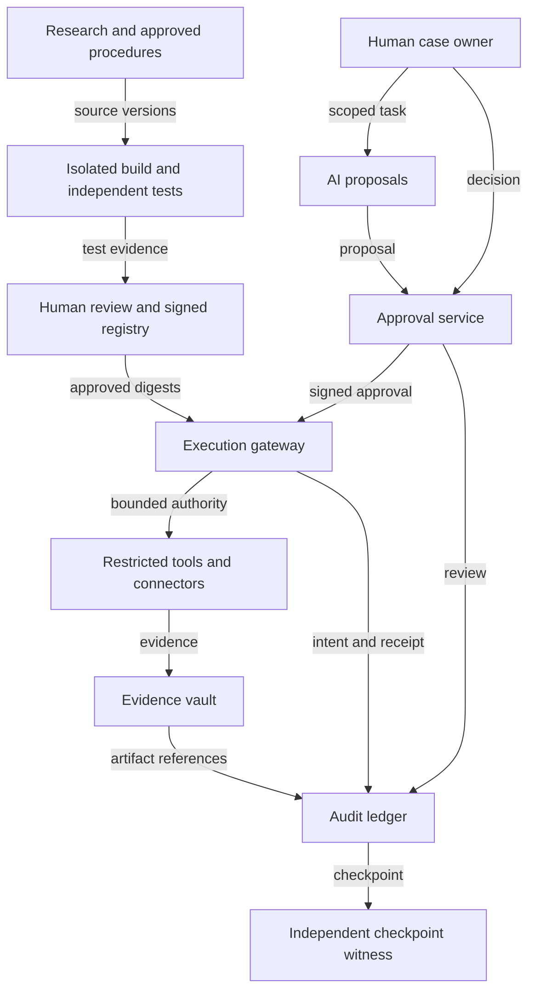
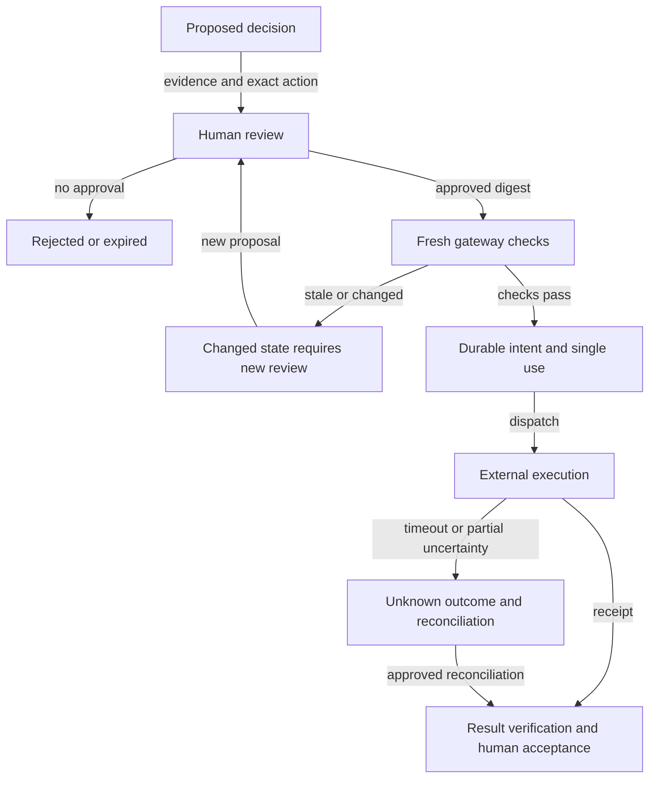

# TraceFoundry IR architecture and decisions

## System architecture

<!-- mermaid:id=runtime_architecture -->

```mermaid
flowchart TB
  accTitle: System architecture
  accDescr: Separate build, case execution, and evidence responsibilities with mandatory human approval.
  SOURCE["Research and approved procedures"]
  BUILD["Isolated build and independent tests"]
  RELEASE["Human review and signed registry"]
  HUMAN["Human case owner"]
  PLANNER["AI proposals"]
  APPROVAL["Approval service"]
  GATE["Execution gateway"]
  TOOLS["Restricted tools and connectors"]
  VAULT["Evidence vault"]
  AUDIT["Audit ledger"]
  WITNESS["Independent checkpoint witness"]
  SOURCE -->|source versions| BUILD
  BUILD -->|test evidence| RELEASE
  RELEASE -->|approved digests| GATE
  HUMAN -->|scoped task| PLANNER
  PLANNER -->|proposal| APPROVAL
  HUMAN -->|decision| APPROVAL
  APPROVAL -->|signed approval| GATE
  GATE -->|bounded authority| TOOLS
  TOOLS -->|evidence| VAULT
  APPROVAL -->|review| AUDIT
  GATE -->|intent and receipt| AUDIT
  VAULT -->|artifact references| AUDIT
  AUDIT -->|checkpoint| WITNESS
%% portable-canonical-v2:eyJhY2Nlc3NpYmlsaXR5IjoiU2VwYXJhdGUgYnVpbGQsIGNhc2UgZXhlY3V0aW9uLCBhbmQgZXZpZGVuY2UgcmVzcG9uc2liaWxpdGllcyB3aXRoIG1hbmRhdG9yeSBodW1hbiBhcHByb3ZhbC4iLCJkYXRhIjp7ImRpcmVjdGlvbiI6IlRCIiwiZWRnZXMiOlt7ImZyb20iOiJTT1VSQ0UiLCJsYWJlbCI6InNvdXJjZSB2ZXJzaW9ucyIsInRvIjoiQlVJTEQifSx7ImZyb20iOiJCVUlMRCIsImxhYmVsIjoidGVzdCBldmlkZW5jZSIsInRvIjoiUkVMRUFTRSJ9LHsiZnJvbSI6IlJFTEVBU0UiLCJsYWJlbCI6ImFwcHJvdmVkIGRpZ2VzdHMiLCJ0byI6IkdBVEUifSx7ImZyb20iOiJIVU1BTiIsImxhYmVsIjoic2NvcGVkIHRhc2siLCJ0byI6IlBMQU5ORVIifSx7ImZyb20iOiJQTEFOTkVSIiwibGFiZWwiOiJwcm9wb3NhbCIsInRvIjoiQVBQUk9WQUwifSx7ImZyb20iOiJIVU1BTiIsImxhYmVsIjoiZGVjaXNpb24iLCJ0byI6IkFQUFJPVkFMIn0seyJmcm9tIjoiQVBQUk9WQUwiLCJsYWJlbCI6InNpZ25lZCBhcHByb3ZhbCIsInRvIjoiR0FURSJ9LHsiZnJvbSI6IkdBVEUiLCJsYWJlbCI6ImJvdW5kZWQgYXV0aG9yaXR5IiwidG8iOiJUT09MUyJ9LHsiZnJvbSI6IlRPT0xTIiwibGFiZWwiOiJldmlkZW5jZSIsInRvIjoiVkFVTFQifSx7ImZyb20iOiJBUFBST1ZBTCIsImxhYmVsIjoicmV2aWV3IiwidG8iOiJBVURJVCJ9LHsiZnJvbSI6IkdBVEUiLCJsYWJlbCI6ImludGVudCBhbmQgcmVjZWlwdCIsInRvIjoiQVVESVQifSx7ImZyb20iOiJWQVVMVCIsImxhYmVsIjoiYXJ0aWZhY3QgcmVmZXJlbmNlcyIsInRvIjoiQVVESVQifSx7ImZyb20iOiJBVURJVCIsImxhYmVsIjoiY2hlY2twb2ludCIsInRvIjoiV0lUTkVTUyJ9XSwibm9kZXMiOlt7ImlkIjoiU09VUkNFIiwibGFiZWwiOiJSZXNlYXJjaCBhbmQgYXBwcm92ZWQgcHJvY2VkdXJlcyJ9LHsiaWQiOiJCVUlMRCIsImxhYmVsIjoiSXNvbGF0ZWQgYnVpbGQgYW5kIGluZGVwZW5kZW50IHRlc3RzIn0seyJpZCI6IlJFTEVBU0UiLCJsYWJlbCI6Ikh1bWFuIHJldmlldyBhbmQgc2lnbmVkIHJlZ2lzdHJ5In0seyJpZCI6IkhVTUFOIiwibGFiZWwiOiJIdW1hbiBjYXNlIG93bmVyIn0seyJpZCI6IlBMQU5ORVIiLCJsYWJlbCI6IkFJIHByb3Bvc2FscyJ9LHsiaWQiOiJBUFBST1ZBTCIsImxhYmVsIjoiQXBwcm92YWwgc2VydmljZSJ9LHsiaWQiOiJHQVRFIiwibGFiZWwiOiJFeGVjdXRpb24gZ2F0ZXdheSJ9LHsiaWQiOiJUT09MUyIsImxhYmVsIjoiUmVzdHJpY3RlZCB0b29scyBhbmQgY29ubmVjdG9ycyJ9LHsiaWQiOiJWQVVMVCIsImxhYmVsIjoiRXZpZGVuY2UgdmF1bHQifSx7ImlkIjoiQVVESVQiLCJsYWJlbCI6IkF1ZGl0IGxlZGdlciJ9LHsiaWQiOiJXSVRORVNTIiwibGFiZWwiOiJJbmRlcGVuZGVudCBjaGVja3BvaW50IHdpdG5lc3MifV19LCJkZXNjcmlwdGlvbiI6bnVsbCwiaWQiOiJydW50aW1lX2FyY2hpdGVjdHVyZSIsImtpbmQiOiJmbG93Y2hhcnQiLCJzb3VyY2VTaGEyNTYiOiIzNGQ2ZTQwMmNlZjkzMzE2YjY2NGJlYzJkYjEyNjQ0NDU4N2VmYzZiMjFmNDFiZjhlNmM4ZWVkNDFhZTE1YjE1Iiwic3R5bGVzIjpbXSwidGl0bGUiOiJTeXN0ZW0gYXJjaGl0ZWN0dXJlIiwidmVyc2lvbiI6MX0
```

## Approval lifecycle

<!-- mermaid:id=decision_flow -->

```mermaid
flowchart TB
  accTitle: Approval lifecycle
  accDescr: Human review precedes gateway checks and execution. Changed or uncertain states cannot silently proceed.
  PROPOSED["Proposed decision"]
  REVIEW["Human review"]
  DENIED["Rejected or expired"]
  VALIDATE["Fresh gateway checks"]
  CHANGED["Changed state requires new review"]
  INTENT["Durable intent and single use"]
  EXECUTE["External execution"]
  UNKNOWN["Unknown outcome and reconciliation"]
  RESULT["Result verification and human acceptance"]
  PROPOSED -->|evidence and exact action| REVIEW
  REVIEW -->|no approval| DENIED
  REVIEW -->|approved digest| VALIDATE
  VALIDATE -->|stale or changed| CHANGED
  CHANGED -->|new proposal| REVIEW
  VALIDATE -->|checks pass| INTENT
  INTENT -->|dispatch| EXECUTE
  EXECUTE -->|timeout or partial uncertainty| UNKNOWN
  EXECUTE -->|receipt| RESULT
  UNKNOWN -->|approved reconciliation| RESULT
%% portable-canonical-v2:eyJhY2Nlc3NpYmlsaXR5IjoiSHVtYW4gcmV2aWV3IHByZWNlZGVzIGdhdGV3YXkgY2hlY2tzIGFuZCBleGVjdXRpb24uIENoYW5nZWQgb3IgdW5jZXJ0YWluIHN0YXRlcyBjYW5ub3Qgc2lsZW50bHkgcHJvY2VlZC4iLCJkYXRhIjp7ImRpcmVjdGlvbiI6IlRCIiwiZWRnZXMiOlt7ImZyb20iOiJQUk9QT1NFRCIsImxhYmVsIjoiZXZpZGVuY2UgYW5kIGV4YWN0IGFjdGlvbiIsInRvIjoiUkVWSUVXIn0seyJmcm9tIjoiUkVWSUVXIiwibGFiZWwiOiJubyBhcHByb3ZhbCIsInRvIjoiREVOSUVEIn0seyJmcm9tIjoiUkVWSUVXIiwibGFiZWwiOiJhcHByb3ZlZCBkaWdlc3QiLCJ0byI6IlZBTElEQVRFIn0seyJmcm9tIjoiVkFMSURBVEUiLCJsYWJlbCI6InN0YWxlIG9yIGNoYW5nZWQiLCJ0byI6IkNIQU5HRUQifSx7ImZyb20iOiJDSEFOR0VEIiwibGFiZWwiOiJuZXcgcHJvcG9zYWwiLCJ0byI6IlJFVklFVyJ9LHsiZnJvbSI6IlZBTElEQVRFIiwibGFiZWwiOiJjaGVja3MgcGFzcyIsInRvIjoiSU5URU5UIn0seyJmcm9tIjoiSU5URU5UIiwibGFiZWwiOiJkaXNwYXRjaCIsInRvIjoiRVhFQ1VURSJ9LHsiZnJvbSI6IkVYRUNVVEUiLCJsYWJlbCI6InRpbWVvdXQgb3IgcGFydGlhbCB1bmNlcnRhaW50eSIsInRvIjoiVU5LTk9XTiJ9LHsiZnJvbSI6IkVYRUNVVEUiLCJsYWJlbCI6InJlY2VpcHQiLCJ0byI6IlJFU1VMVCJ9LHsiZnJvbSI6IlVOS05PV04iLCJsYWJlbCI6ImFwcHJvdmVkIHJlY29uY2lsaWF0aW9uIiwidG8iOiJSRVNVTFQifV0sIm5vZGVzIjpbeyJpZCI6IlBST1BPU0VEIiwibGFiZWwiOiJQcm9wb3NlZCBkZWNpc2lvbiJ9LHsiaWQiOiJSRVZJRVciLCJsYWJlbCI6Ikh1bWFuIHJldmlldyJ9LHsiaWQiOiJERU5JRUQiLCJsYWJlbCI6IlJlamVjdGVkIG9yIGV4cGlyZWQifSx7ImlkIjoiVkFMSURBVEUiLCJsYWJlbCI6IkZyZXNoIGdhdGV3YXkgY2hlY2tzIn0seyJpZCI6IkNIQU5HRUQiLCJsYWJlbCI6IkNoYW5nZWQgc3RhdGUgcmVxdWlyZXMgbmV3IHJldmlldyJ9LHsiaWQiOiJJTlRFTlQiLCJsYWJlbCI6IkR1cmFibGUgaW50ZW50IGFuZCBzaW5nbGUgdXNlIn0seyJpZCI6IkVYRUNVVEUiLCJsYWJlbCI6IkV4dGVybmFsIGV4ZWN1dGlvbiJ9LHsiaWQiOiJVTktOT1dOIiwibGFiZWwiOiJVbmtub3duIG91dGNvbWUgYW5kIHJlY29uY2lsaWF0aW9uIn0seyJpZCI6IlJFU1VMVCIsImxhYmVsIjoiUmVzdWx0IHZlcmlmaWNhdGlvbiBhbmQgaHVtYW4gYWNjZXB0YW5jZSJ9XX0sImRlc2NyaXB0aW9uIjpudWxsLCJpZCI6ImRlY2lzaW9uX2Zsb3ciLCJraW5kIjoiZmxvd2NoYXJ0Iiwic291cmNlU2hhMjU2IjoiYjI1M2RmZTc1OTZlMGQ3ZWQyMDVlMTJlNzY5MGUyY2I0YzY2YTI5MjI5ZWQ2YzhhYTk2Yzg1ZWE5NTgwYzJlYSIsInN0eWxlcyI6W10sInRpdGxlIjoiQXBwcm92YWwgbGlmZWN5Y2xlIiwidmVyc2lvbiI6MX0
```
